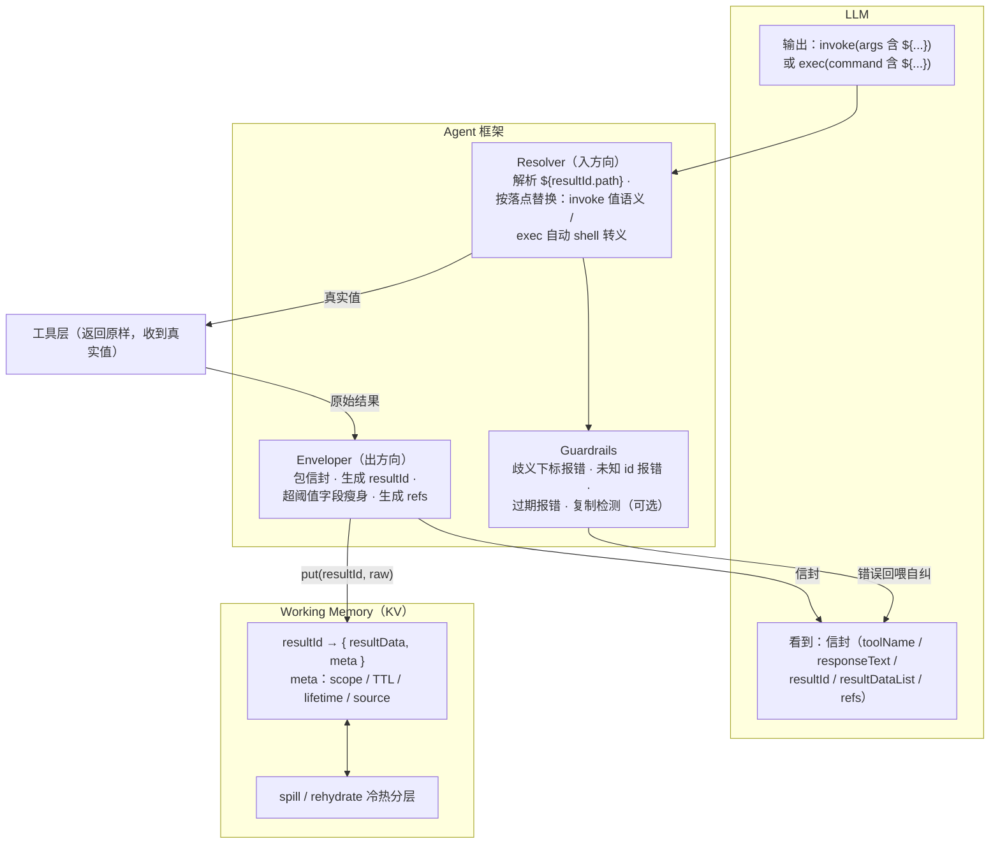
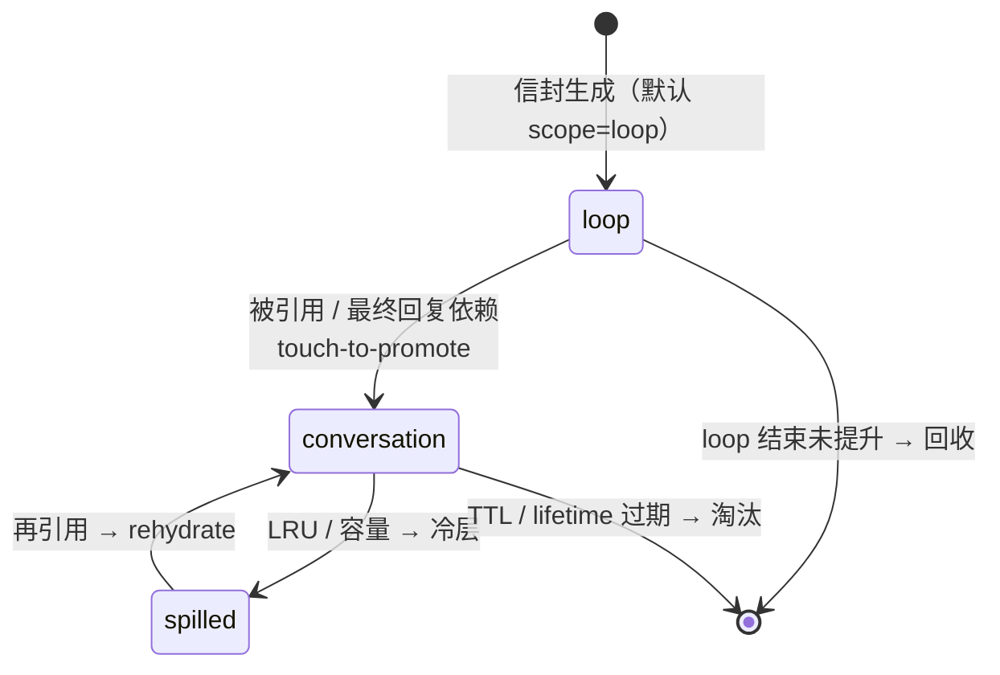

# Agent 工具结果变量化方案 v3：透明信封方案（Envelope + Working Memory）

> 系列文档：[v1 框架侧提取](./agent-variable-scheme.md) ·
> [v2 分层解耦](./agent-variable-scheme-v2-decoupled.md) · **v3 透明信封（本文）**
>
> v3 定位：**工具返回结果原样不动**，框架统一包一层"信封"（envelope）交给模型，
> 完整结果按 `resultId → resultData` 存入 Working Memory（KV）。
> 下游工具引用时，模型输出 `${resultId.path}` 占位符（skill 中显式指引"复制 refs，勿抄内容"），
> Agent 框架在执行前解析替换，同时支持 `invoke()` 结构化参数与 `exec(command)` 命令字符串两种落点。

---

## 1. 与 v1 / v2 的关系

| | v1 框架侧提取 | v2 分层解耦 | v3 透明信封 |
|---|---|---|---|
| 工具改动 | 需声明 exportable | 零改动（可选 $export） | **零改动** |
| 模型所见 | 替身 stub（长值不可见） | 替身 stub | **信封 + 结果原文**（超阈值字段可选瘦身） |
| 存储粒度 | 提取的字段 | 整个 toolResult | 整个 toolResult（KV：resultId → resultData） |
| 变量命名 | 语义名 v1_log_path | 工具缩写+序号 find1 | **8 位随机 resultId**（跨轮/跨分支不撞名） |
| 引用指引 | system prompt 全局规则 | stub 内嵌 $ref | **refs 成品引用串 + skill 级显式指引** |
| 替换落点 | 结构化参数 | 结构化参数 | **invoke() 参数 + exec(command) 字符串（自动转义）** |

v3 不是推翻 v2，而是基线层的另一种实现选型：**信息透明优先**（模型能看到并推理结果内容），
用信封统一结构、用 skill 指引和成品引用串压制"模型忍不住抄原文"的倾向。

---

## 2. 整体架构



---

## 3. 信封规范（Envelope）

工具原始返回（**原样，不要求任何配合**）：

```json
{"img_uri": "https://cdn.example.com/imgs/2026/08/10/f7c3a91e-...-4096x1716_v1.png?sig=Kx7Qw9f2...&exp=1754800000", "createTime": "2026-08-10T04:05:12Z"}
```

框架包装后给模型的信封：

```json
{
  "toolName": "image_gen",
  "responseText": "已生成 2 张候选横幅图（4096×1716）。完整 URL 已存入 a3f8k2p9，引用时请复制 refs 中的占位串，不要抄写 URL 内容。",
  "resultId": "a3f8k2p9",
  "resultDataList": [
    {
      "img_uri": {"$preview": "https://cdn.example.com/imgs/2026/08/10/f7c3a91e-…_v1.png?sig=Kx7Q…", "$size": 246},
      "createTime": "2026-08-10T04:05:12Z",
      "style": "深色科技风"
    },
    {
      "img_uri": {"$preview": "https://cdn.example.com/imgs/2026/08/10/b2e4d07c-…_v2.png?sig=Mn3P…", "$size": 246},
      "createTime": "2026-08-10T04:05:12Z",
      "style": "浅色简约风"
    }
  ],
  "refs": {
    "resultDataList[0].img_uri": "${a3f8k2p9.resultDataList[0].img_uri}",
    "resultDataList[1].img_uri": "${a3f8k2p9.resultDataList[1].img_uri}"
  }
}
```

**字段定义**：

| 字段 | 来源 | 说明 |
|---|---|---|
| `toolName` | 框架 | 原始工具名 |
| `responseText` | 工具提供，缺省框架生成 | 自然语言摘要 + 引用提醒 |
| `resultId` | 框架 | 8 位小写字母数字随机 id（base36），会话内查重防撞；随 checkpoint 持久 |
| `resultDataList` | 工具原始返回 | 原样保留；**超阈值（默认 200 字符）叶子值瘦身**为 `{$preview, $size}`；短值原样可推理 |
| `refs` | 框架 | **成品引用串**，模型只复制不拼装；只为"瘦身字段 + 精确复述型字段"生成 |

**瘦身开关**是信封内的策略参数：全文透明（阈值=∞，即你最初的形态）与全部替身（阈值=0，即 v2 形态）
是同一机制的两个端点，按内容类型配置（如 base64 强制瘦身、URL 阈值 200、纯文本阈值 1000）。

---

## 4. 引用语法与替换管线

### 4.1 引用语法

```
${resultId.JSONPath}
```

- 标准形：`${a3f8k2p9.resultDataList[0].img_uri}`，列表**强制显式下标**；
- 语法糖：`resultDataList` 仅一个元素时允许 `${a3f8k2p9.img_uri}`；多元素且省写下标 → **报错回喂，不猜**；
- 整值引用保留原类型（对象/数组可整体注入 invoke 参数）；出现在字符串内部则内插拼接。

### 4.2 替换时机（与 v1/v2 相同）

```
LLM 输出 → 解析 → schema 校验（占位符按字符串通过） → ${} 解析替换 ← 执行前最后一步 → 工具执行
```

替换后的真实值**不回写对话历史**，历史里永远是 `${...}`。

### 4.3 按落点（sink）自动转义 —— v3 新增的关键规范

| 落点 | 替换语义 | 转义规则 |
|---|---|---|
| `invoke()` JSON 参数 | 值语义，保留类型 | 无需转义（JSON 序列化天然安全） |
| `exec(command)` shell 字符串 | 文本内插 | **自动 shell 单引号包裹**：值包为 `'…'`，内部单引号转义为 `'\''`；含换行/控制字符的值直接拒绝并报错 |
| 最终回复文本（可选扩展） | 文本内插 | Markdown 转义 |

**白名单加严选项**：`exec` 落点只允许引用字符集为 `[A-Za-z0-9_\-./:?&=%]` 的值；
不满足的值（可能含注入载荷）只准走 `invoke()`，或先由工具落盘成文件后传路径。
这是针对**间接提示注入 → 命令注入**链路的硬防线：工具结果内容不可信，
凡进 shell 必须框架转义，模型和 skill 都不承担转义责任。

### 4.4 Skill 级显式指引（提升遵循率）

在依赖上游结果的工具（skill）描述中加一段固定话术：

> 参数 `source` 通常来自上游工具结果。请**直接复制上游信封 `refs` 中的 `${...}` 占位串**作为参数值，
> 不要抄写 URL/路径的具体内容。框架会在执行前自动替换为真实值。

全局 system prompt 保留一条兜底规则即可，细则随 skill 走——工具作者最清楚自己的参数来源。

---

## 5. 错误处理（全部"不执行 + 报错回喂 + 自纠"）

| 错误 | 触发 | 回喂内容 |
|---|---|---|
| `unknown_result_id` | `${zzz99999.…}` 查无此 id | 当前 Working Memory 内可用 resultId 清单（含 toolName、responseText 摘要） |
| `unknown_path` | id 存在但路径不存在 | 该 resultId 下全部可用 refs |
| `ambiguous_index` | 多元素列表省写下标 | 列出各下标的候选引用串及区分信息 |
| `reference_expired` | meta 中 lifetime 已过 | 过期时间 + 建议重新调用来源工具 |
| `unsafe_exec_value` | exec 落点值含控制字符/超出白名单 | 建议改用 invoke 或落盘传路径 |
| 复制检测（可选软护栏） | 模型输出的参数值与 Working Memory 中某长值全等/高相似 | 软提醒改用引用（不阻断执行） |

---

## 6. 端到端详细示例

### 场景

Turn 1 用户说：

> "帮我生成一张产品发布会横幅图，裁剪成 16:9，下载到本地后上传到 CMS。"

工具：`image_gen`（生图）、`edit_image`（裁剪，invoke 形态）、`exec`（shell 命令）、`cms_upload`。

---

### 步骤 ①：`image_gen` —— 出方向包信封

模型输出：

```json
invoke("image_gen", {"prompt": "产品发布会横幅，科技感", "n": 2, "size": "4096x1716"})
```

工具原始返回两张候选图（每个 `img_uri` 是 246 字符带签名 CDN URL）。框架：

1. 生成 `resultId = a3f8k2p9`，**原始结果原样存入 Working Memory**；
2. `img_uri` 超阈值（246 > 200）→ 信封内瘦身为 `{$preview, $size}`；`createTime`、`style` 短值原样保留；
3. 为两个瘦身字段生成 `refs` 成品引用串；
4. 信封写入上下文（即第 3 节的示例 JSON）。

**Working Memory 状态**：

| resultId | 内容 | scope | meta |
|---|---|---|---|
| `a3f8k2p9` | image_gen 原始返回（2 张图完整 URL） | loop | source=image_gen, sig URL exp=08-10 12:00Z |

---

### 步骤 ②：`edit_image` —— 歧义报错与自纠

模型看过两张图的 `style` 字段后选中第 2 张（浅色简约风），但引用时省写了下标：

```json
invoke("edit_image", {"source": "${a3f8k2p9.img_uri}", "op": "crop", "ratio": "16:9"})
```

`resultDataList` 有 2 个元素，语法糖不成立 → **不执行**，报错回喂：

```json
{
  "error": "ambiguous_index",
  "message": "a3f8k2p9.resultDataList 含 2 个元素，须显式下标。候选：${a3f8k2p9.resultDataList[0].img_uri}（深色科技风）、${a3f8k2p9.resultDataList[1].img_uri}（浅色简约风）"
}
```

模型复制正确引用串重试：

```json
invoke("edit_image", {"source": "${a3f8k2p9.resultDataList[1].img_uri}", "op": "crop", "ratio": "16:9"})
```

Resolver 值语义替换 → `edit_image` 收到完整 246 字符 URL（工具对变量机制零感知）→
返回裁剪后新图，框架包新信封 `resultId = k2m9x4qt`（含新 `img_uri` 的 ref）。

---

### 步骤 ③：`exec` —— 命令字符串替换 + 自动转义

模型输出（占位符直接写进 shell 命令，只花 ~14 个 token）：

```json
exec(command="curl -sS -o /tmp/banner_169.png ${k2m9x4qt.resultDataList[0].img_uri}")
```

Resolver 识别落点为 `exec`：值通过白名单检查 → **自动单引号包裹**后替换，实际执行：

```bash
curl -sS -o /tmp/banner_169.png 'https://cdn.example.com/imgs/2026/08/10/9d1f…_crop169.png?sig=Tz5m…&exp=1754800000'
```

> URL 里的 `&` 若不转义会把命令截断成后台任务——这就是"框架统一转义、模型不碰转义"的价值。
> 若该值含 `; rm -rf` 之类载荷（间接注入），单引号包裹使其只能作为字面量，无法逃逸。

---

### 步骤 ④：`cms_upload` —— 短值内联与引用混用

```json
invoke("cms_upload", {"file": "/tmp/banner_169.png", "title": "产品发布会横幅", "source_ref": "${k2m9x4qt.resultDataList[0].img_uri}"})
```

`/tmp/banner_169.png` 是模型自己指定的短路径，**内联即可**（不是所有参数都要引用化）。
上传成功，模型给出最终回复，**Turn 1 结束**。

**生命周期结算**：`a3f8k2p9`、`k2m9x4qt` 均被引用 → 提升为 `conversation`；
原图信封 `a3f8k2p9` 后续无引用，若干轮后 TTL 淘汰或 spill。

---

### Turn 2（次日）：跨轮引用 + 过期报错

用户："把那张裁剪好的图再传一份到备份 CMS。"

框架在 user message 末尾附加清单（append-only，保护 prompt 前缀缓存）：

```xml
<available_results>
  a3f8k2p9  image_gen   2 张候选横幅原图      conversation(spilled)  URL 已于 08-10 12:00Z 过期
  k2m9x4qt  edit_image  16:9 裁剪图           conversation           URL 已于 08-10 12:00Z 过期
</available_results>
```

模型引用 `${k2m9x4qt.resultDataList[0].img_uri}` → Resolver 查 meta 发现签名 URL 已物理过期：

```json
{
  "error": "reference_expired",
  "message": "${k2m9x4qt.resultDataList[0].img_uri} 的签名已于 2026-08-10T12:00:00Z 过期。本地文件 /tmp/banner_169.png 可能仍存在，或重新调用 edit_image。"
}
```

模型自纠：改用本地文件路径直接调用 `cms_upload`，完成任务。

---

## 7. 生命周期（沿用 v1/v2 的四级作用域）



- Working Memory 随 agent 状态一起 **checkpoint**，恢复会话时 `${...}` 不悬垂；
- 8 位随机 resultId 跨轮、跨分支（对话回退重放）全局唯一，不存在 v2 序号命名的撞名问题；
- 引用任一子路径为整个 resultId 续期（KV 粒度即结果粒度，接受这一粗粒度）。

---

## 8. 落地模块清单

| 模块 | 职责 | 关键接口 |
|---|---|---|
| `Enveloper` | 包信封、生成 resultId、阈值瘦身、生成 refs、responseText 兜底 | `wrap(toolName, rawResult) -> envelope` |
| `WorkingMemory` | KV 存取、作用域/TTL/LRU、spill/rehydrate、checkpoint | `put / get / touch / end_of_loop / snapshot` |
| `Resolver` | `${}` 解析、路径寻址、按落点替换与转义 | `resolve(args_or_command, sink) -> resolved` |
| `Guardrails` | 六类错误检测与回喂、exec 白名单、复制检测 | `check(...) -> ok \| error_envelope` |
| Skill 规范 | 依赖上游结果的参数附固定引用指引话术 | 文档约定 |

**安全约定**：只在参数值/命令字符串位置替换；工具结果原文中的 `${` 字面量入库时转义防二次展开；
exec 落点强制框架转义 + 字符白名单；子 agent 不共享 Working Memory，跨 agent 显式解析传值。
