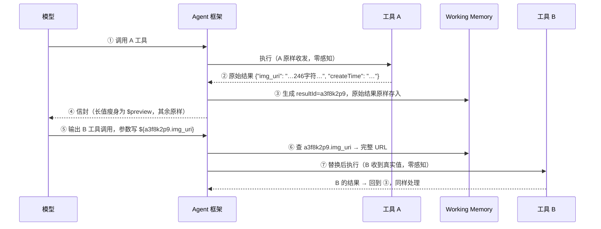

# Agent 变量方案 v4（最终版）

> 一句话：**A 工具结果由框架存进 Working Memory 并包一层信封给模型，模型调 B 工具时用
> `${resultId.key}` 引用，框架在执行 B 之前替换成真实值。** 工具零改动，模型零抄写。

---

## 1. 完整流程



要点：替换发生在 **schema 校验之后、执行之前**；替换后的真实值**不回写对话历史**，
历史里永远是 `${…}`。

## 2. 信封：模型看到什么 vs 内存存什么

工具 A 原始返回（**原样，无需任何修改**）：

```json
{"img_uri": "https://cdn.example.com/imgs/2026/08/10/f7c3a91e-…-4096.png?sig=Kx7Qw9f2…&exp=1754800000", "createTime": "2026-08-10T04:05:12Z"}
```

**Working Memory 存的**（KV，原样）：

```
a3f8k2p9 → {"img_uri": "https://cdn.example.com/…完整 246 字符…", "createTime": "2026-08-10T04:05:12Z"}
```

**模型看到的信封**：

```json
{
  "toolName": "image_gen",
  "responseText": "已生成图片。引用时请使用 ${a3f8k2p9.字段名}，不要抄写内容。",
  "resultId": "a3f8k2p9",
  "resultData": {
    "img_uri": {"$preview": "https://cdn.example.com/…_v1.png?sig=Kx7Q…", "$size": 246},
    "createTime": "2026-08-10T04:05:12Z"
  }
}
```

| 规则 | 说明 |
|---|---|
| `resultData` = 原始结果的 key/value | 结构不变；超阈值（默认 200 字符）的 value 瘦身为 `{$preview, $size}`，短值原样保留供模型推理 |
| `resultId` | 框架生成的 8 位随机 id，跨轮唯一 |
| `responseText` | 工具提供，缺省框架生成；附一句引用提醒 |

## 3. 引用与替换

**引用语法**：`${resultId.key}`，直接用 id + 字段名，如 `${a3f8k2p9.img_uri}`。
结果含嵌套/数组时按路径写：`${a3f8k2p9.items[0].url}`。

**Skill 指引**（写在依赖上游结果的工具描述里）：

> 参数值来自上游工具结果时，直接写 `${resultId.字段名}` 占位符，不要复制其内容，框架会自动替换。

**两种落点**：

```json
invoke("edit_image", {"source": "${a3f8k2p9.img_uri}", "op": "crop", "ratio": "16:9"})
```

```bash
exec(command="curl -o /tmp/img.png ${a3f8k2p9.img_uri}")
# 框架替换时自动 shell 转义 → curl -o /tmp/img.png 'https://cdn.example.com/…&exp=…'
```

| 落点 | 替换规则 |
|---|---|
| `invoke()` 参数 | 值语义注入，保留类型；字符串内可拼接（`${id.key}/sub/path`） |
| `exec(command)` | 自动单引号包裹转义（URL 中 `&` 等特殊字符、注入载荷均无法逃逸） |

**出错即回喂**：id 不存在 / 字段不存在 / 已过期 → 不执行工具，返回 tool error 并附
该 resultId 下可用的字段清单，模型自纠重试。

## 4. 生命周期

| 阶段 | 规则 |
|---|---|
| 创建 | 信封生成时入库，默认 `loop` 作用域（当前这轮 agent loop） |
| 提升 | 被引用即提升为 `conversation`，跨轮可用；每次引用续期 |
| 淘汰 | N 轮未引用 TTL 淘汰；大值可先降级磁盘，再引用时读回 |
| 过期 | 工具可声明有效期（如签名 URL），过期后引用报错并提示重新获取 |
| 恢复 | Working Memory 随对话状态一起 checkpoint，恢复后 `${…}` 不悬垂 |

## 5. 落地清单

| 模块 | 职责 |
|---|---|
| Enveloper | 生成 resultId、原始结果入库、长值瘦身、包信封 |
| WorkingMemory | KV 存取、作用域/TTL、checkpoint |
| Resolver | `${}` 解析、按落点替换与转义（invoke 值语义 / exec shell 转义） |
| Skill 规范 | 依赖上游结果的参数附一句引用指引 |

安全约定：只替换参数值/命令字符串位置；工具结果原文中的 `${` 入库转义防伪造；exec 强制框架转义。
